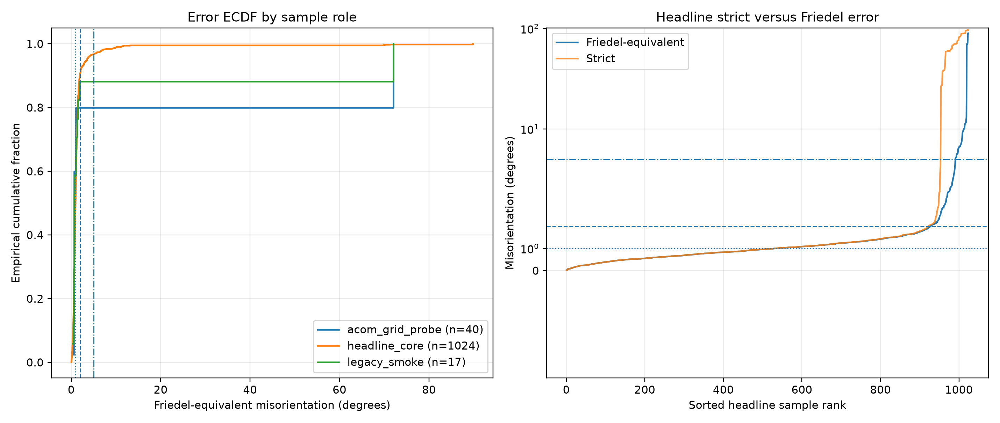
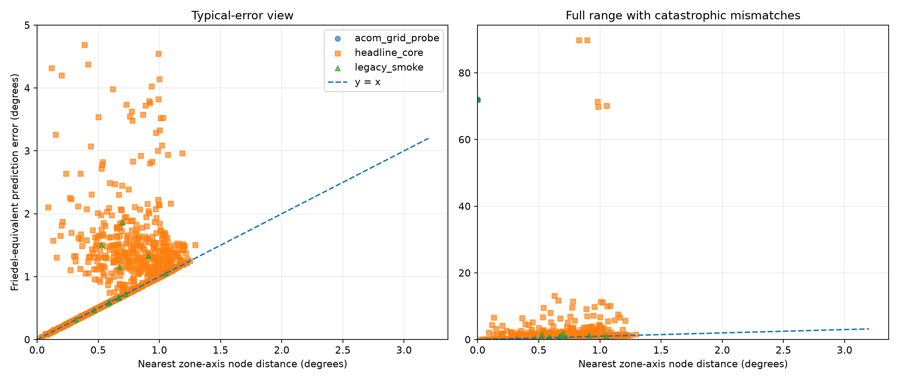
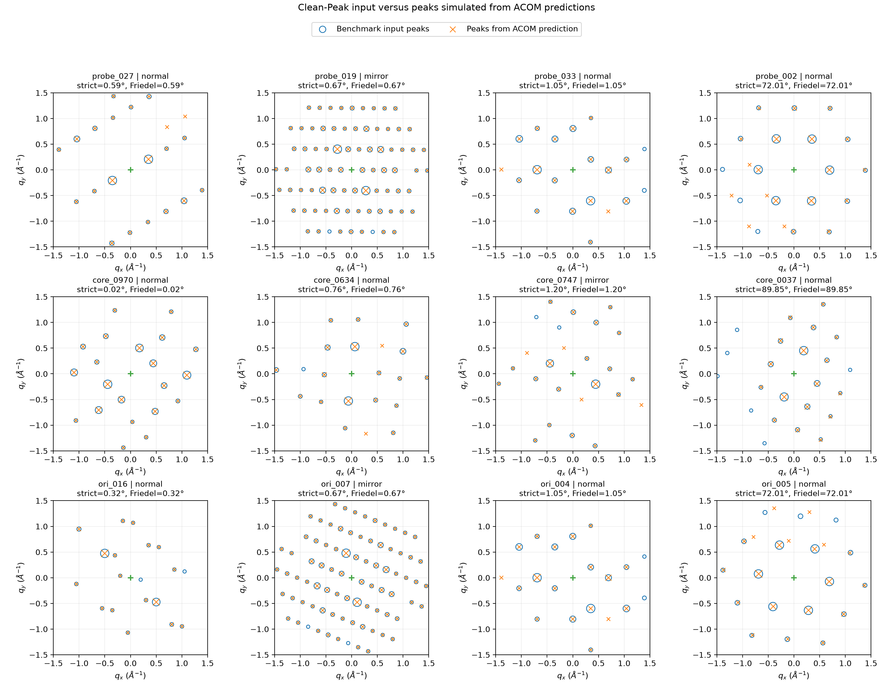

# NCM811 Clean-Peak ACOM Report

- Dataset: `OR4D-NCM811-CleanPeak-acom-v3`
- Headline cohort: `headline_core` (1024 samples)
- Primary metric: Friedel-equivalent misorientation under proper crystal point-group rotations
- Canonical baseline: py4DSTEM ACOM, 2° zone-axis step and 2° in-plane step

## Headline result

| Metric | n | Mean | Median | P90 | P95 | Max | Acc@1° | Acc@2° | Acc@5° |
| --- | ---: | ---: | ---: | ---: | ---: | ---: | ---: | ---: | ---: |
| Friedel-equivalent | 1024 | 1.625 | 0.977 | 1.922 | 3.525 | 89.850 | 52.1% | 90.5% | 96.7% |
| Strict | 1024 | 5.703 | 0.978 | 1.979 | 59.748 | 96.620 | 52.0% | 90.0% | 93.1% |

Strict/Friedel disagreement rate: 6.45%.
Catastrophic mismatches: 34/1024 above 5°; 12/1024 above 10°.

## ACOM angular-resolution sweep

Controlled comparison: all sweep rows have identical config, CIF, orientation-manifest, public-peak and ground-truth SHA256 values and identical software versions. Only the zone-axis and in-plane angular steps change.

| Step | n | Mean | Median | P95 | Max | Acc@1° | Acc@2° | Acc@5° | Seeds incl. mirror | Match time | Throughput |
| ---: | ---: | ---: | ---: | ---: | ---: | ---: | ---: | ---: | ---: | ---: | ---: |
| 4° | 1024 | 2.991 | 1.625 | 5.311 | 89.899 | 20.8% | 68.3% | 94.6% | 49680 | 15.3 s | 70.4/s |
| 3° | 1024 | 2.581 | 1.283 | 5.069 | 90.071 | 32.3% | 84.7% | 94.8% | 119040 | 32.8 s | 32.9/s |
| 2° (canonical) | 1024 | 1.625 | 0.977 | 3.525 | 89.850 | 52.1% | 90.5% | 96.7% | 389160 | 110.2 s | 9.8/s |

## Result by sample role

| Role | n | Mean | Median | P90 | P95 | Max | Acc@1° | Acc@2° | Acc@5° |
| --- | ---: | ---: | ---: | ---: | ---: | ---: | ---: | ---: | ---: |
| acom_grid_probe | 40 | 14.996 | 0.667 | 72.006 | 72.006 | 72.006 | 60.0% | 80.0% | 80.0% |
| headline_core | 1024 | 1.625 | 0.977 | 1.922 | 3.525 | 89.850 | 52.1% | 90.5% | 96.7% |
| legacy_smoke | 17 | 9.227 | 0.667 | 29.922 | 72.006 | 72.006 | 58.8% | 88.2% | 88.2% |

## Headline result by nearest zone-axis node distance

| Distance bin | n | Mean | Median | P90 | P95 | Max | Acc@1° | Acc@2° | Acc@5° |
| --- | ---: | ---: | ---: | ---: | ---: | ---: | ---: | ---: | ---: |
| [0, 0.5)° | 205 | 0.785 | 0.398 | 1.723 | 2.571 | 6.634 | 74.1% | 91.2% | 98.5% |
| [0.5, 1)° | 648 | 1.757 | 0.930 | 1.908 | 3.412 | 89.850 | 59.0% | 90.9% | 96.9% |
| [1, 2)° | 171 | 2.128 | 1.225 | 2.936 | 5.693 | 70.131 | 0.0% | 88.3% | 93.6% |

## ACOM diagnostics

- Zone-axis node distance/error Pearson correlation: 0.108
- Discrete seed distance/error Pearson correlation: 0.084
- Discrete seed distance is diagnostic only. ACOM performs a parabolic sub-grid fit of the in-plane correlation peak, so it is not an error lower bound.
- Plan nodes: 1081 zone axes × 180 in-plane steps; 389160 seeds including mirror.
- Plan build: 0.097 s.
- Matching: 110.206 s total, 0.0975 s p50, 0.1228 s p90, 0.1580 s p99, 9.8 samples/s.

## Reproducibility

- Source git revision: `efb0672e3766e1ca48883028bc0b6f7b666b85bc`
- Versions: Python 3.11.15, NumPy 1.26.4, py4DSTEM 0.14.18, pymatgen 2024.7.18, h5py 3.16.0
- SHA256 `cif`: `60f28f9d4ace01baeab707d22c8de267ce0c7759c3574598fb1abe84e4fef94f`
- SHA256 `config`: `0b4dec56efef03c800195244d29e8b8e3c9154499c5739618f341c6c86cb18ed`
- SHA256 `ground_truth`: `e21741a3afa5af4a4e7f55b6bad04c44e1925ee07d8ac67d4692d24460ae9247`
- SHA256 `orientation_manifest`: `8cd01fd71503f434137390ca05050093ae324bd7f9f0b2f196372ec6edf5f88b`
- SHA256 `public_peaks`: `8cd3d73f8d5c818096b740af84a43ee5be0c61ca13fa139095a9d41ceb034685`

## Interpretation boundary

Clean inputs and ACOM templates use the same CIF and py4DSTEM kinematical model; this measures self-consistency, not real-data or cross-simulator generalization.

逐坐标、逐反射、HKL 和 ACOM 峰差异见 [ACOM coordinate analysis](ACOM_COORDINATE_ANALYSIS.md)。
